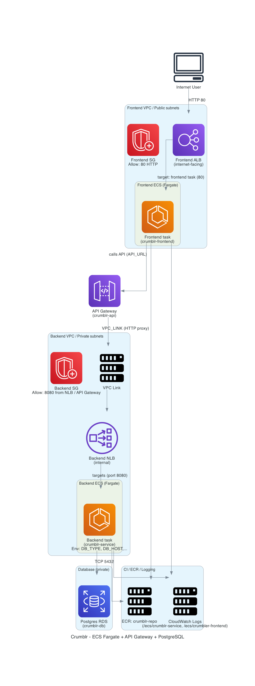
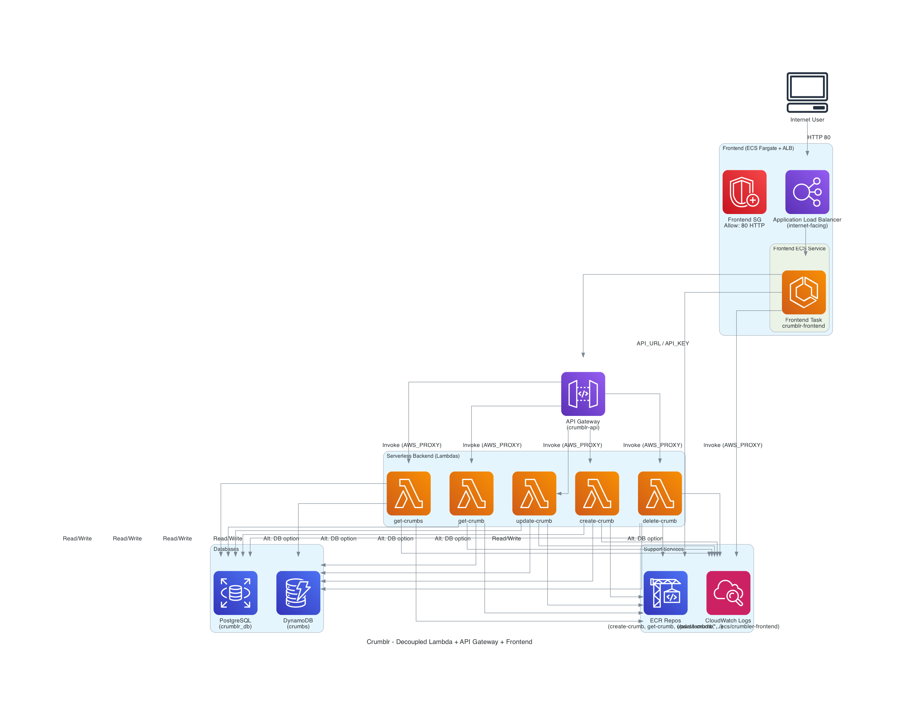

# Practica Entregable: CRUMBLR
## Descripción de la aplicación
Crumblr es una página web sucesora espiritual de tumblr en la que es posible hacer microblogging con capacidad de estilo de html. En el proyecto se encuentras dos implementaciones, la primera es la que se encuentra en la carpeta raíz, que es la acoplada, y en mi opinión, la más correcta para el volumen de la aplicación.

Por otra parte se encuentra la versión Desacoplada en ["DESACOPLADO"](./DESACOPLADO/). Esta versión para el modelo de negocio de mi aplicación supone más que una mejora de escalabilidad, un problema de encarecimiento ya que el uso de lambdas dispara el coste del lanzamiento con que la usen un par de miles de usuarios.

- **Arquitectura "Acoplada":** 
  - Monolito tradicional con ECS Fargate + API Gateway
  - Frontend que utiliza ECS Fargate
- **Arquitectura Desacoplada:** 
  - Microservicios con Lambda + API Gateway
  - Frontend separado en un ECS Fargate


## Bases de datos:
- Postgres
Utilicé postgres porque es la base de datos con la que estoy más familiarizado y porque encaja bien con el tipo de aplicación que estoy creando.

### Diagrama de arquitectura
#### Arquitectura "Acoplada": 


#### Arquitectura Desacoplada:


### Componentes principales **ACOPLADO**
- **API Gateway (REST)**: expone los recursos `crumbs` y `crum` y enruta al backend vía VPC Link. Protegido con API Key.
- **VPC Link + NLB**: el VPC Link conecta API Gateway con un Network Load Balancer interno que apunta al servicio de ECS.
- **ECS Fargate 1**: ejecuta el contenedor de la app Flask definido en `/Crumblr-Front/Dockerfile` y `/Crumblr-Front/mainFront.yml`.
- **ECS Fargate 2**: ejecuta el contenedor del frontend `Dockerfile` y `main.yml`.
- **Bases de datos**:
  - **PostgreSQL (Amazon RDS)** en el VPC, con SG de acceso al puerto 5432.
- **Amazon ECR**: repositorio para la imagen del contenedor.

### Componentes principales **DESACOPLADO**

- **API Gateway:** expone los recursos crumbs y crumb/{id} y enruta al backend vía integración Lambda (AWS_PROXY). Protegido con API Key.
- **AWS Lambda:** funciones serverless (create-crumb, get-crumbs, get-crumb, update-crumb, delete-crumb) que ejecutan la lógica de negocio y acceden a la base de datos.
- **Bases de datos:**
  - **PostgreSQL** en el VPC, con Security Group que permite acceso desde las Lambdas.
- **ECS Fargate (Frontend):** ejecuta el contenedor de la app frontend definido en Dockerfile y front.yml, expuesto mediante un Application Load Balancer (ALB).
- **Amazon ECR:** repositorios para las imágenes de los contenedores (backend Lambdas y frontend ECS).
- **Amazon CloudWatch Logs:** captura logs de las Lambdas y del servicio ECS para monitoreo.

### Estructura del proyecto
```
.
├── aws_diagram_coupled.py       # Script para generar diagrama acoplado de la arquitectura
├── aws_diagram_decoupled.py     # Script para generar diagrama desacoplado de la arquitectura
├── buildandpush.sh               # Script general para build y push de imágenes Docker
├── crumblr_architecture_coupled.png     # Imagen del diagrama acoplado
├── crumblr_architecture_decoupled.png   # Imagen del diagrama desacoplado

# Backend principal (modelo acoplado)
├── Crumblr-Back
│   ├── db                        # Módulos de manejo de base de datos
│   │   ├── db.py
│   │   ├── factory.py
│   │   └── postgres_db.py
│   ├── ecr.yml                    # Configuración de ECR para backend
│   ├── main.py                    # Entrypoint de la app Flask
│   └── models
│       └── crumb.py               # Modelo de datos de "crumb"

# Frontend principal
├── Crumblr-Front
│   ├── app.js                     # Lógica principal del frontend
│   ├── buildandpush.sh            # Script para build y push de la imagen del frontend
│   ├── Crumb-ecr-gui.yaml         # Configuración de ECR para frontend
│   ├── dockerfile                 # Dockerfile del frontend
│   ├── frontEC2Cluster.yaml       # Plantilla CloudFormation para ECS o EC2
│   ├── index.html                 # HTML principal
│   ├── nginx.conf                 # Configuración de Nginx
│   └── style.css                  # Estilos del frontend

# Parámetros de base de datos
├── db_params.json
├── db_postgres.yml                 # Plantilla CloudFormation para RDS/PostgreSQL

# Arquitectura desacoplada (serverless + ECS frontend)
├── DESACOPLADO
│   ├── BUILDALLECR.yml             # Configuración de build/push de todas las imágenes
│   ├── Crumblr-Back
│   │   ├── BUILDANDPUSHALL.sh      # Script para construir y subir todas las Lambdas
│   │   ├── lambda
│   │   │   ├── functions           # Cada función Lambda como carpeta independiente
│   │   │   │   ├── create-crumb
│   │   │   │   │   ├── app.py      # Código Lambda
│   │   │   │   │   ├── buildandpush.sh
│   │   │   │   │   ├── dockerfile
│   │   │   │   │   ├── ecr.yml
│   │   │   │   │   └── shared      # Código compartido entre Lambdas
│   │   │   │   │       ├── db
│   │   │   │   │       │   ├── db.py
│   │   │   │   │       │   ├── factory.py
│   │   │   │   │       │   └── postgres_db.py
│   │   │   │   │       ├── models
│   │   │   │   │       │   └── crumb.py
│   │   │   │   │       └── services
│   │   │   │   │           └── crumb_service.py
│   │   │   │   ├── delete-crumb    # Igual que create-crumb (mismo patrón)
│   │   │   │   ├── get-crumb
│   │   │   │   ├── get-crumbs
│   │   │   │   └── update-crumb
│   │   │   └── shared               # Shared code global para todas las Lambdas
│   │   └── reload_lambda.sh         # Script para redeploy de Lambdas
│   ├── Crumblr-Front
│   │   ├── app.js
│   │   ├── buildandpush.sh
│   │   ├── Crumb-ecr-gui.yaml
│   │   ├── dockerfile
│   │   ├── frontEC2Cluster.yaml
│   │   ├── index.html
│   │   ├── nginx.conf
│   │   └── style.css
│   ├── db_postgres.yml
│   ├── main.yml                     # Plantilla principal CloudFormation para todo el stack desacoplado
│   └── test_curl.sh                 # Script de prueba para la API

# Dockerfile general
├── Dockerfile

# Scripts de utilidad
├── getapikey.sh                     # Script para obtener API Key
├── getapikey.sh~                    # Backup

# Informe del proyecto
├── INFORME
│   ├── Informe.aux
│   ├── Informe.log
│   ├── Informe.out
│   ├── Informe.pdf
│   ├── Informe.synctex.gz
│   └── Informe.tex

# Diagramas y parámetros principales
├── infraestructura_aws_simple.png
├── main_params.json
├── main.sh
├── main.yml

# Ejemplos y pruebas
├── P4-2
│   ├── arreglos_api_gateway.yml
│   ├── ejemplo_lambda_codigo.yml
│   └── ejemplo_lambda_ECR.yml
├── readme.md
├── requirements.txt
└── TEST
    ├── curl.sh
    └── windows_test.sh

```

### API
- **POST** `/crumbs`: crea un crumb.
- **GET** `/crumbs`: lista todos los crumbs.
- **GET** `/crumbs/{id}`: obtiene un crumb específico.
- **PUT** `/crumbs/{id}`: actualiza un crumb.
- **DELETE** `/crumbs/{id}`: elimina un crumb.
- **GET** `/health`: comprobación de salud del servicio.

### Variables de entorno

- **DB_TYPE**: `postgres` (por defecto) o `dynamodb`.
- Si `DB_TYPE=postgres`:
  - **DB_HOST**, **DB_NAME**, **DB_USER**, **DB_PASS**.
- Si `DB_TYPE=dynamodb`:
  - **DB_DYNAMONAME**: nombre de la tabla (por defecto `tickets`).


### Despliegue en AWS **ACOPLADO** (CloudFormation)

Orden recomendado de plantillas:

1. `ecr.yml` → crea el repositorio y subir la imagen.
2. `buildandpush.sh` → IMPORTANTE sustituir datos por los de su cuenta aws
3. `db_postgres.yml` → crea la base de datos.
4. `main.yml` → despliega VPC Link, NLB, ECS Fargate, API Gateway y enlaza la imagen y variables.
5. `Crumblr-Front/Crumb-ecr-gui` → repo del gui.
6. `Crumblr-Front/app.js` → cambiar los campos de apiurl y apikey para el resultante.
7. `Crumblr-Front/buildandpush.sh` → Cambiar los valores como antes.
8. `Crumblr-Front/buildandpush.sh` → frontEC2Cluster.

Parámetros clave de `main.yml`:

- **ImageName**: `<repo>:<tag>` en ECR.
- **VpcId**, **SubnetIds**: VPC y subredes existentes.
- **DBType**: `postgres` o `dynamodb`.
- Campos de DB correspondientes: `DBHost`, `DBName`, `DBUser`, `DBPass` o `DBDynamoName`.


### COSTO:
#### Acoplado:
***Calculo para un supuesto uso moderado de la aplicación***
- ECS:
Pricing calculations
10 GB per hour / 1 GB processed bytes per hour per LCU for EC2 instances and IP addresses as targets = 10 processed bytes LCUs for EC2 instances and IP addresses as targets
100 new connections per second / 25 new connections per second per LCU = 4 new connections LCUs
100 new connections per second x 300 seconds = 30,000 active connections
30,000 active connections / 3000 connections per LCU = 10 active connections LCUs
Max (0 USD, 0 USD) = 0.00 paid rules per request
Max (10 processed bytes LCUs , 4 new connections LCUs , 10 active connections LCUs , 0 rule evaluation LCUs ) = 10 maximum LCUs
1 load balancers x 10 LCUs x 0.01 LCU price per hour x 730 hours per month = 73.00 USD
Application Load Balancer LCU usage charges (monthly): 73.00 USD

#### Fuente:
- [aws pricing calculator](https://calculator.aws/)
- [chatGPT]()
- [claude]()
### Notas

- La región de las prácticas es `us-east-1`.
- El contenedor expone el puerto 8080 y el NLB escucha en el mismo puerto.
- Se deja tanto el grupo de seguridad de la tarea de ECS como de la BBDD abierto para que los alumnos puedan acceder desde fuera para validar su trabajo. Permitiéndoles debuggear de forma sencilla.

### Uso de IA
- Ayuda en el desarrollo del frontend.
- Ayuda en el proceso de debuggeo (Explicarme por que me salian los errores que me salian y que significaban).
- En un momento del desarrollo se me rompió la indentanción en el main.yml desacoplado y lo arreglé con IA.
- Aprendizaje de la herramienta de diagramas "diagram" de python.
- Debugging de backend desacoplado.
- Correcciones de ortografía y redacción.
- Identificación de errores de concepto en los yaml